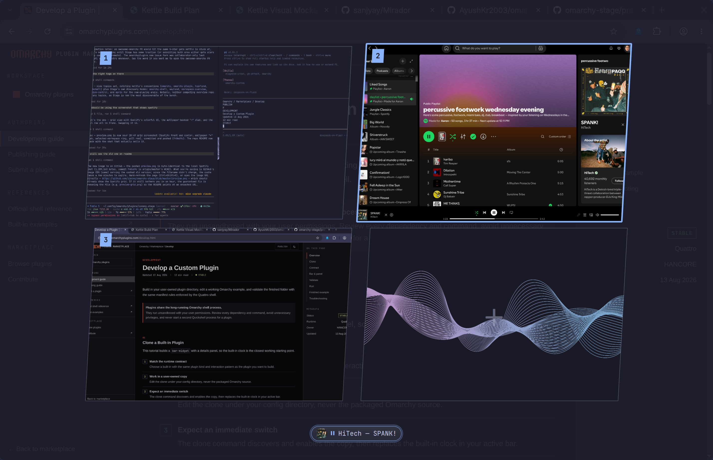

# Stage

[](https://github.com/zzwong/omarchy-stage/actions/workflows/lint.yml)
[](LICENSE)
[](https://omarchyplugins.com/plugin.html?id=zzwong.stage)

Mission Control for Omarchy. One keypress (or a three-finger swipe) shows
every workspace as a live preview in the theme-picker's slice carousel;
`Esc`, a click outside, or a swipe down closes it.




The selected workspace expands to a large live preview — real window content
via screencopy, including workspaces you can't see — with the others fanned
out as skewed slices, same shape language as `omarchy theme set`.

## Install

```bash
omarchy plugin add https://github.com/zzwong/omarchy-stage --enable
```

Then bind a key — Omarchy already uses `Super+Tab` for workspace cycling, so
`` Super+` `` (right above Tab) is a good spot, in
`~/.config/hypr/bindings.lua`:

```lua
o.bind("SUPER + GRAVE", "Stage", "omarchy-shell shell toggle zzwong.stage")
```

On a touchpad, three-finger swipes feel great too (gestures are user config
in Omarchy) — add to `~/.config/hypr/input.lua`:

```lua
hl.gesture({
  fingers = 3,
  direction = "up",
  action = function() hl.exec_cmd("omarchy-shell shell toggle zzwong.stage") end,
})
hl.gesture({
  fingers = 3,
  direction = "down",
  action = function() hl.exec_cmd("omarchy-shell shell hide zzwong.stage") end,
})
```

## Uninstall

```bash
omarchy plugin remove zzwong.stage
```

Then drop the keybind or gestures you added.

## Use

| Input | Action |
|---|---|
| `←` `→` `Tab` `Shift-Tab` | move through workspaces |
| two-finger swipe ← → | same, in the carousel (walks panes when zoomed in) |
| `↑` / `↓` | one zoom axis: grid ↕ carousel ↕ panes. In the grid, arrows move spatially and leaving the top or bottom edge falls back to the carousel; in the carousel, `↓` zooms into the workspace's windows — `←` `→` walk them, `Enter` focuses one, `↑` backs out |
| `Enter` | jump to the selected workspace |
| `1`–`9` | jump to that workspace directly |
| click a slice | select it |
| click the expanded preview | jump — window thumbnails are individually clickable |
| the `+` slot at the end | create the next workspace |
| `Esc` / click outside | close |

Below the carousel, one pill per window. Windows with an MPRIS player
(Spotify, browsers, mpv) show album art, artist — track, and a play/pause
button that works without leaving the overview. Windows emitting audio
without MPRIS get a speaker badge. Labels that don't fit marquee on hover.
Every pill is click-to-focus.

## Settings

Optional. Defaults are built in; to override:

```bash
cp ~/.config/omarchy/plugins/zzwong.stage/settings.example.json \
   ~/.config/omarchy/plugins/zzwong.stage/settings.json
```

`settings.json` is re-read each time Stage opens:

| Key | Values | Meaning |
|---|---|---|
| `style` | `"picker"` (default), `"cards"` | slice carousel, or a flat row of equal cards |
| `view` | `"auto"` (default), `"carousel"`, `"grid"` | `auto` opens in the carousel with `↑`/`↓` zooming between views; the others lock Stage to a single view |
| `badgeStyle` | `"badge"` (default), `"omarchy"` | cards style only: rounded-square badge, or the bar's bare numeral/glyph |
| `keybindMode` | `"toggle"` (default), `"cycle"` | `cycle` makes releasing the modifier jump to the selection — see below |

### Stepping keys

A summon carrying a `step` moves the selection when Stage is already open,
and opens Stage when it isn't. Bind one per direction, in
`~/.config/hypr/bindings.lua`:

```lua
hl.unbind("SUPER + TAB")
hl.unbind("SUPER + SHIFT + TAB")
o.bind("SUPER + TAB", "Stage",
  "omarchy-shell shell summon zzwong.stage '{\"step\":1}'")
o.bind("SUPER + SHIFT + TAB", "Stage back",
  "omarchy-shell shell summon zzwong.stage '{\"step\":-1}'")
```

Any chord works; the example unbinds Omarchy's stock `Super+Tab` workspace
cycling only because Stage supersedes it. Stepping works in either
`keybindMode` — on its own it's just another way to move the selection while
Stage is open.

### Hold-to-cycle

Add `"keybindMode": "cycle"` to `settings.json` and those stepping keys
become alt-tab: keep `Super` held, tap to walk the workspaces, release
`Super` to jump to the selected one. Opening Stage without stepping commits
nothing, so a plain tap still just opens it and `←` `→` `Enter` `Esc` behave
as always.

Hold-to-cycle watches for `Super` specifically, so pick a `Super` chord for
your stepping keys — a step carries no modifier of its own, and committing on
any modifier release would jump on one you never cycled with. Leave the hold
idle for ten seconds and the jump disarms; `Enter` still commits.

Stepping is the only navigation available while `Super` is down: Hyprland
keeps its own `Super` chords, so `Super`+arrows stay window focus and never
reach Stage. Release without stepping to browse with the arrows instead.

When Stage is zoomed into a workspace's windows (`↓`), stepping walks those
windows instead, and releasing `Super` focuses the selected one.

Only a step arms the jump, so `hide` always means hide — the swipe-down
gesture and `Esc` close Stage no matter what is held.

## Notes

- Workspace previews map the monitor's usable area (bar struts excluded) and
  overscan slightly so outer gaps never show.
- Only workspaces on the focused monitor are shown; special workspaces are
  skipped.
- Colors come entirely from the Omarchy theme (`image-picker` and `menu`
  surfaces, plus the accent), so it re-themes with `omarchy theme set`.

## License

MIT
