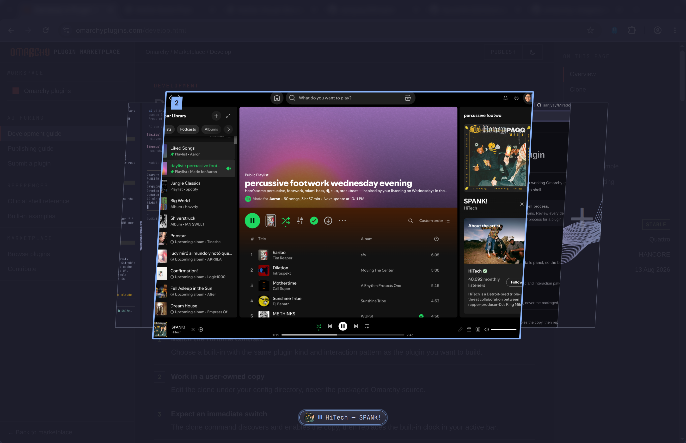

# Overview

Mission Control for Omarchy. Three-finger swipe up shows every workspace as a
live preview in the theme-picker's slice carousel; swipe down, `Esc`, or a
click outside closes it.



The selected workspace expands to a large live preview — real window content
via screencopy, including workspaces you can't see — with the others fanned
out as skewed slices, same shape language as `omarchy theme set`.

## Install

```bash
omarchy plugin add https://github.com/zzwong/omarchy-overview --enable
```

Gestures are user config in Omarchy, so add to `~/.config/hypr/input.lua`:

```lua
hl.gesture({
  fingers = 3,
  direction = "up",
  action = function() hl.exec_cmd("omarchy-shell shell toggle zzwong.overview") end,
})
hl.gesture({
  fingers = 3,
  direction = "down",
  action = function() hl.exec_cmd("omarchy-shell shell hide zzwong.overview") end,
})
```

Or bind a key to `omarchy-shell shell toggle zzwong.overview`.

## Use

| Input | Action |
|---|---|
| `←` `→` `Tab` `Shift-Tab` | move through workspaces |
| `↑` / `↓` | zoom out to a grid of every workspace / back to the carousel; in the grid, arrows move spatially and `↓` past the bottom row falls back to the carousel |
| `Esc` | steps back one level: grid → carousel → closed |
| `Enter` | jump to the selected workspace |
| `1`–`9` | jump to that workspace directly |
| click a slice | select it |
| click the expanded preview | jump — window thumbnails are individually clickable |
| the `+` slot at the end | create the next workspace |
| `Esc` / click outside | close |

Below the carousel, one pill per window. Windows with an MPRIS player
(Spotify, browsers, mpv) show album art, artist — track, and a play/pause
button that works without leaving the overview. Windows emitting audio
without MPRIS get a speaker badge. Labels that don't fit marquee on hover.
Every pill is click-to-focus.

## Settings

Optional. Defaults are built in; to override:

```bash
cp ~/.config/omarchy/plugins/zzwong.overview/settings.example.json \
   ~/.config/omarchy/plugins/zzwong.overview/settings.json
```

`settings.json` hot-reloads on save:

| Key | Values | Meaning |
|---|---|---|
| `style` | `"picker"` (default), `"cards"` | slice carousel, or a flat row of equal cards |
| `badgeStyle` | `"badge"` (default), `"omarchy"` | cards style only: rounded-square badge, or the bar's bare numeral/glyph |

## Notes

- Workspace previews map the monitor's usable area (bar struts excluded) and
  overscan slightly so outer gaps never show.
- Only workspaces on the focused monitor are shown; special workspaces are
  skipped.
- Colors come entirely from the Omarchy theme (`image-picker` and `menu`
  surfaces, plus the accent), so it re-themes with `omarchy theme set`.

## License

MIT
