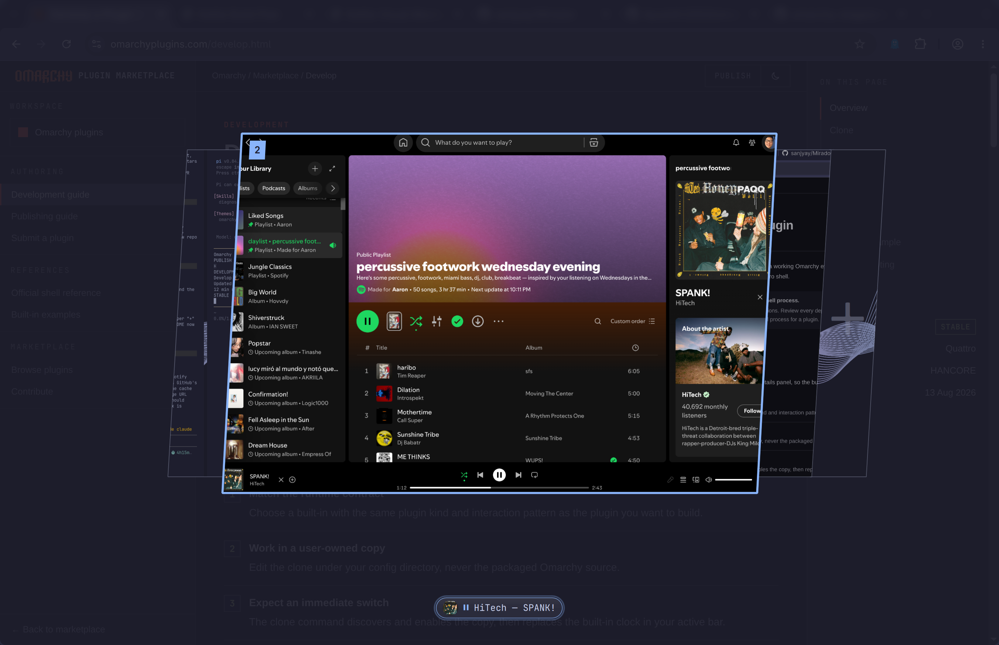
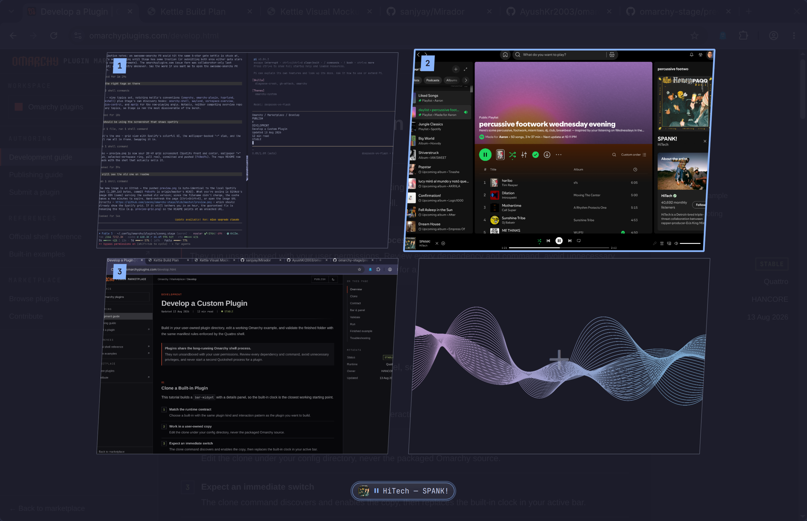

# Stage

[](CHANGELOG.md)
[](https://github.com/zzwong/omarchy-stage/actions/workflows/lint.yml)
[](LICENSE)
[](https://plugins.omarchy.org/plugin.html?id=zzwong.stage)

Mission Control for Omarchy. Open a live overview of the workspaces on your
focused monitor, switch between them, and manage their windows.





## Install

```bash
omarchy plugin add https://github.com/zzwong/omarchy-stage --enable
```

Add a keybind to `~/.config/hypr/bindings.lua`. This example uses
`` Super+` `` because Omarchy already uses `Super+Tab`:

```lua
o.bind("SUPER + GRAVE", "Stage", "omarchy-shell shell toggle zzwong.stage")
```

For touchpad gestures and optional `Super+Tab` cycling, see
[Settings and keybindings](docs/configuration.md).

## Use

| Input | Action |
|---|---|
| `←` `→` or `Tab` `Shift-Tab` | Select a workspace; in pane mode, select a window |
| `↑` / `↓` | Move between grid, carousel, and window panes |
| `Enter` | Open the selected workspace or focus the selected window |
| `1`–`9` | Jump to a workspace |
| Click a slice or window thumbnail | Select or open it |
| Drag a thumbnail in grid view | Move the window to another workspace or the `+` slot |
| `X` in pane mode, or `×` on a thumbnail or title pill | Request a window close |
| `Shift` + arrow in pane mode | Swap with a neighbouring tiled window |
| `Ctrl-Shift` + `←` / `→` in pane mode | Move the window to the previous or next workspace shown |
| `+` slot | Create the next workspace |
| `Esc` or click outside | Close Stage |

Two-finger horizontal swipes browse the carousel or, when zoomed in, its
windows. Window title pills below the carousel show media controls when
available. Stage stays open while you close or move windows.

See [Window management](docs/window-management.md) for drag, close, and
keyboard movement behavior and limitations.

## Settings

Settings are optional. Copy the example to override the defaults:

```bash
cp ~/.config/omarchy/plugins/zzwong.stage/settings.example.json \
   ~/.config/omarchy/plugins/zzwong.stage/settings.json
```

`settings.json` is re-read each time Stage opens. It supports `style`
(`picker` or `cards`), `view` (`auto`, `carousel`, or `grid`), `badgeStyle`,
and `keybindMode` (`toggle` or `cycle`). See
[Settings and keybindings](docs/configuration.md) for values and examples.

Stage shows regular workspaces on the focused monitor and uses the current
Omarchy theme. Window actions require Omarchy's default Hyprland Lua config.

## Uninstall

```bash
omarchy plugin remove zzwong.stage
```

Remove any keybinds or gestures you added.

## License

MIT
